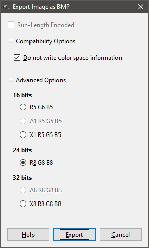

# Java app setup

## Motivation

This project is based on the [java lib export project](https://github.com/andreasgottardi/javalibexport) and is extended to create a working setup file that can be distributed and installed on target machines. The process of creating a deployable and providing this deployable to the role of the customer creates a clear line between software development and software usage. Errors are not fixed anymore in the running environment. Further more running environments need little to no prerequisites fulfilled. Because this is a Java program, a Java runtime environment has to be installed and the Java executable has to be in the path variable. The installation comes with three different launchers:

1. A PowerShell launcher
2. A Batch/cmd launcher
3. A Bash launcher

They all do the same: Set the classpath to the lib folder and execute Java with the correct main class.

This is a template project that can be extended to support Java applications that are installed in a Windows environment. Future functionality could be.

  * Update check via web service
  * Automated uninstall in case a new version is found
  * Automatic installation of a Java environment
  * Per user configuration
  * Silent install and uninstall
  * ...

## Prerequisites

The project requires [NSIS](https://nsis.sourceforge.io/Main_Page) to be available on the system. It makes no difference if the setup distribution is used or if it is downloaded as and extracted from the Zip distribution. An easy and automated installation method can be found [here](https://github.com/andreasgottardi/powershell/tree/master/autoinst/nsis). It does not require admin privileges and installs Nsis into:
```
$env:LOCALAPPDATA\Programs\Nsis\nsis-<version>
```
Further more the path variable is set to make the "makensis.exe" command available for the current user.

## Usage

The setup can be created using the following Gradle command

```powershell
.\gradlew.bat cS
```

This generates the setup in the build folder. The setup contents reside in the folder "build/setup".

The setup comes with an integrated uninstaller which is stored in the installation folder. It can be used to completely remove the application from the computer.

The application version defined in the file "build.gradle" is also passed to the installer, is shown in the bottom watermark and is used in the setup filename. Therefor the version string is passed to "makensis.exe" via commandline parameter ("/D"). This can also be done for other dynamic parameters.

## Configuration

Resources are located in the folder "setup". It contains the main setup defintion ("setup.nsi"), logo and icons and a license template that is integrated into the setup. The setup also sets a Registry key but does not remove it when being uninstalled. This is an example on how to store data and configurations over multiple installations.

### Logo modification

If the logo is modified, some certain settings have to be applied. If [Gimp](https://www.gimp.org) is used the logo has to be exported as a bitmap file (".bmp" ending) and the following configuration is required for the logo to be shown in the setup.

